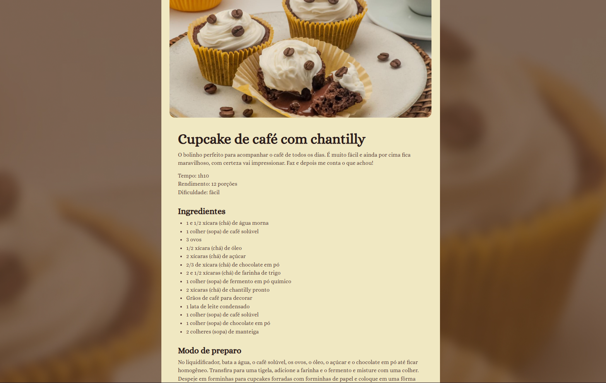

<h1 align="center"> 🍲 Página de Receita </h1>

Este projeto é uma página web simples que apresenta uma receita culinária, desenvolvida com HTML e CSS. É ideal para iniciantes que desejam praticar e aprimorar suas habilidades em desenvolvimento front-end.

## 📸 Preview do Projeto

  

🔗 Acesse o Projeto
Você pode visualizar a página hospedada no GitHub Pages:

👉 [Página receita](https://gelzieny.github.io/pagina-receita/) 👈

📁 Estrutura do Projeto

- **index.html** – Estrutura principal da página.
- **style.css** – Estilos aplicados à página.
- **assets/** – Pasta destinada a imagens e outros recursos.
- **.vscode/** – Configurações específicas do editor VS Code.
- **.github/** – Arquivos de configuração do GitHub.

🚀 Tecnologias Utilizadas

HTML5
CSS3

# 🧑🏻‍💻 Autor

Feito com ❤️ por Gelzieny R. Martins 👋🏽 [Entre em contato!](https://www.linkedin.com/in/gelzieny-r-martins-180551106/)
